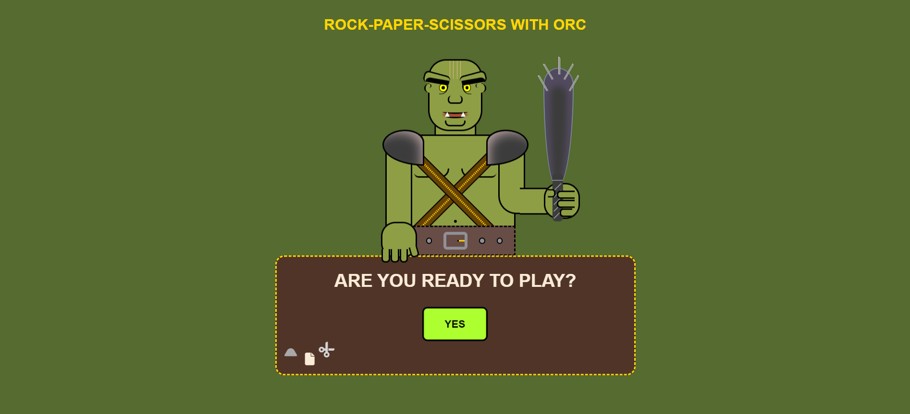

# Rock-paper-scissors with Orс (Frontend project)
_Desktop version only_

A beloved game of rock-paper-scissors takes on a creative twist. In this version, your opponent is a fierce orc. Victory will be determined by luck and your intuition.

*The project was created by me as a practical task to consolidate knowledge of HTML, CSS, JavaScript*

**==> View all [screenshots](_docs/screenshots.md)**

## Summary

* [Philosophy](#philosophy)
* [License](#license)
* [Technical stack](#technical-stack)
* [Installation](#installation)

## Philosophy
I tried to adhere to two main principles:

* [KISS](https://en.wikipedia.org/wiki/KISS_principle)
* [Unix philosophy](https://en.wikipedia.org/wiki/Unix_philosophy)

## License

[GPL : https://en.wikipedia.org/wiki/GNU_General_Public_License](https://en.wikipedia.org/wiki/GNU_General_Public_License)

## Technical stack

Frontend 

* **JavaScript** : manipulation of DOM and JS events, adding sound effects.
* **СSS** : setting styles and animations. The project was drawn entirely using CSS.
* **HTML** : Creating a Project Structure

## Installation

To work with the project you will need **Git**
* [How to install Git.](https://git-scm.com/book/en/v2/Getting-Started-Installing-Git)

### Local installation:

On the command line, navigate to the folder where the project will be deployed. Then copy it from GitHub:

`$ git clone https://github.com/saintgregoire/Game.git`